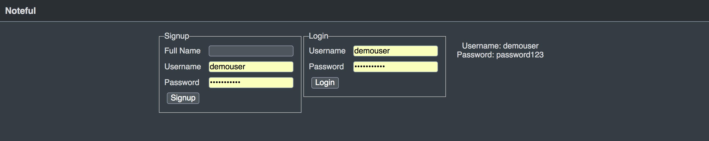
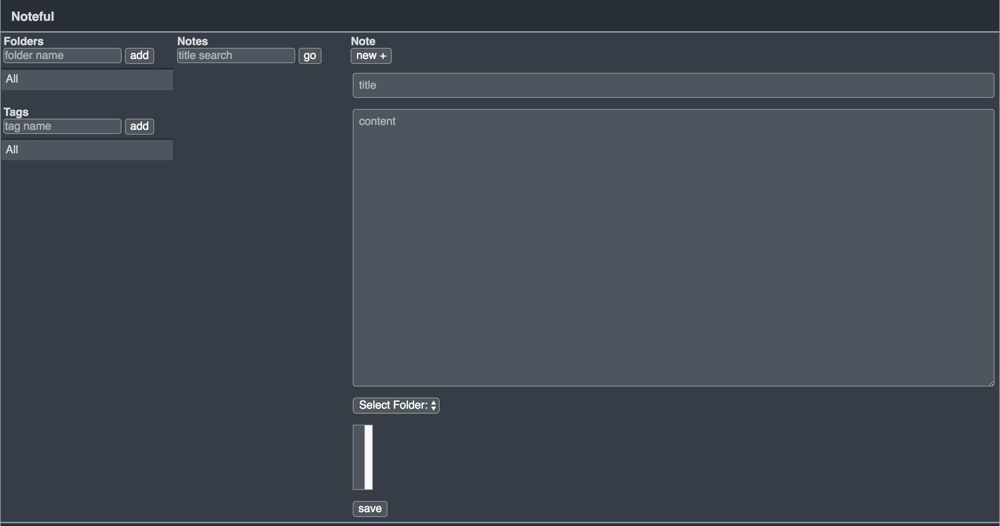

# Noteful

Group project - Backend by Kevin Murphy

### Live App

live URL: https://kevin-noteful-v4.herokuapp.com/

### About this app

This is a simple note taking app. It was a group project for which I built the backend four separate times to practice four different ways of making a backend server and persisting data. Most notably, I made this backend with MongoDB as well as PostgreSQL demonstrating knowledge of both SQL and noSQL. Choosing whether to use SQL or noSQL is based on whether or not your data is structured/unstructured and how your datasets interact with each other.

### Screencaps

## Minimum Viable Product (MVP)

- Signup
- Login
- A clear logout procedure
- Persistance of data
- Effective implementation of user authentication
